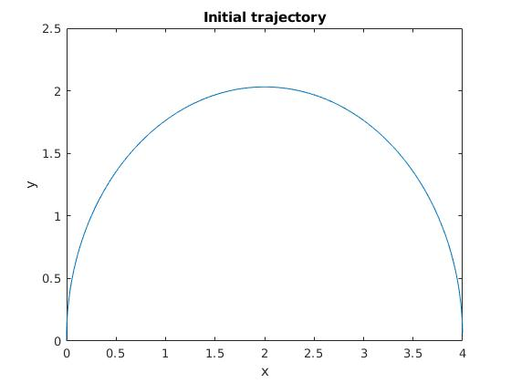
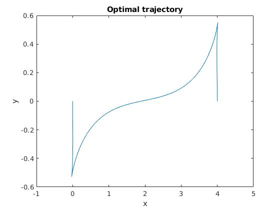
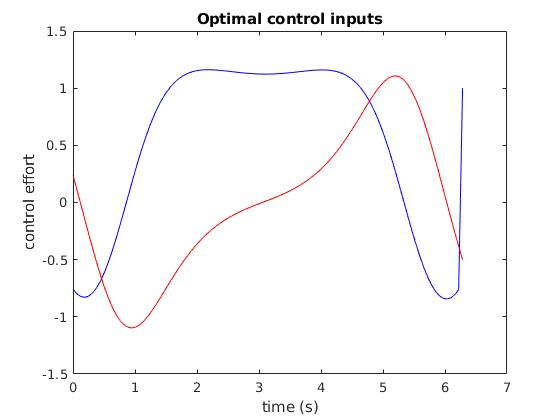

# Problem 1

Problem 1 uses direct collocation to find optimal control signals to parallel park a kinematic car.

## Description
The kinematic car is ubiquitous as a toy problem. Its equations of motion are
```
dx_dt = cos(theta)*u1
dy_dt = sin(theta)*u1
dtheta_dt = u2
```

`x`, `y`, and `theta` are the position and orientation of the car. `u1` is the forward velocity of the car, and `u2` is the rotational velocity.

The kinematic car is so ubiquitous because it is a simple example of a system with nonholonomic constraints: the car cannot move sideways.

Appropriately, the desired trajectory in this problem is a purely horizontal motion. We want the car to move 4 units to the right in 2&pi; seconds while maintining its initial orientation (aligned with the y-axis).

## Plots
The initial trajectory is a semicircular path, resulting from constant control signals `u1 = 1`, `u2 = -0.5`. These controls put the car in the right final location but the orientation is wrong (by 180 &deg;).



Using 101 timesteps, the optimization completes in about 13 seconds and returns a nice parallel-parking trajectory:



That trajectory is the result of the following control signals:



Notice how nice and smooth the control signals are!
