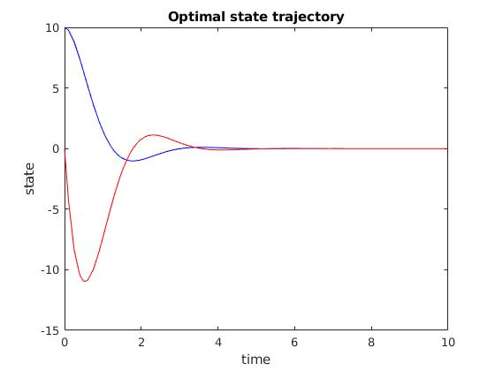

# Problem 2

## Description
This problem demonstrates how to find an optimal control signal for a linear time-invariant (LTI) system by solving a two point boundary value problem (TPBVP).

## Plots

