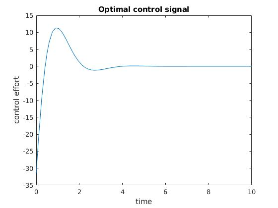

# Problem 2

## Description
This problem demonstrates how to find an optimal control signal for a linear time-invariant (LTI) system by solving a two point boundary value problem (TPBVP).

## Plots

## Exploring around the optimizer
To verify we have found the optimizer, we can evaluate the directional derivative of the objective function, in a bunch of directions which are perturbations to the state + control trajectory.

Just as the state trajectory `x(t)` is a function of the control input `u(t)`, the perturbation `z(t)` to the state trajectory is a function of the perturbation `v(t)` to the control input. In other words, we can't arbitrarily choose `z(t)` but we can arbitrarily choose `v(t)`, which influences `z(t)`. I chose `v(t)` to be a sinusoidal signal of the form `v(t) = a sin(bt + c) + d`, and used MATLAB's `randi()` function to generate 10 random values of `a`, `b`, `c`, and `d`. Below I plotted the control perturbations `v(t)` and the resulting state perturbations `z(t)`:

The optimizer is a minimum of the objective function, so the directional derivative in all 10 of these arbitrary directions `(z(t), v(t))` should be 0, within numerical error tolerances. The table below shows just that!

Note that I don't have nice compact expressions for `z(t)`, only for `v(t)`, because `z(t)` is the solution to a linear _time-varying_ differential equation.
