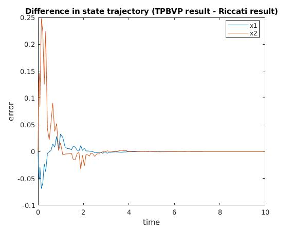
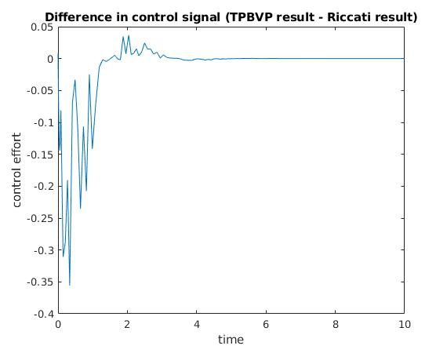

# Problem 3

## Description
This problem uses the solution to a matrix-valued Riccati equation to find the optimal control signal for the same system as in [problem 2](/Control/HW/Code/problem2).

## Plots
Here is the difference in control signals calculated by solving the TPBVP in Problem 2 and the Riccati equation in Problem 3:

Here is the resulting difference in state trajectories between the TPBVP and Riccati methods:

