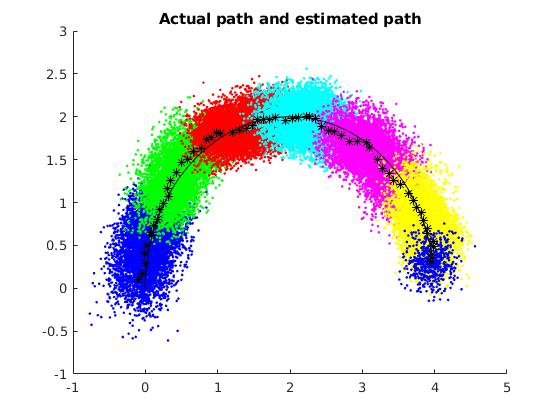

# Problem 1
State estimation with a particle filter

## System description
The kinematic car:
```
    [dx_dt] = cos(theta)*u1
    [dy_dt] = sin(theta)*u1
[dtheta_dt] = u2
```
with initial condition `[0,0,pi/2]`, `dt` = 0.1, and normally distributed process and measurement noise with variance of 0.05.

## Plot


