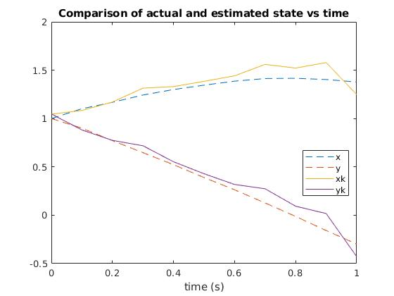
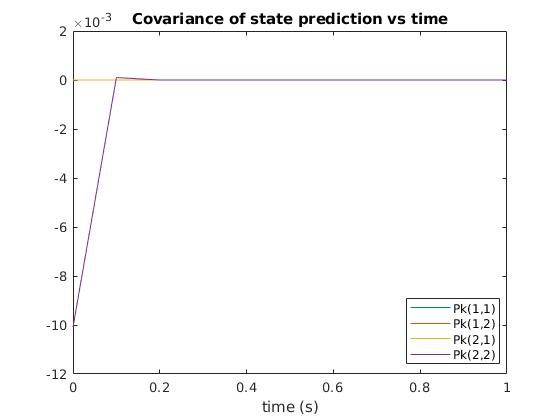

# Problem 2
State estimation with a Kalman filter

## System description
```
[dxdt] = y
[dydt] = -x
```
with initial condition [1,1], `dt` = 0.1, and normally distributed process and measurement noise with variance of 0.1.

## Plots




