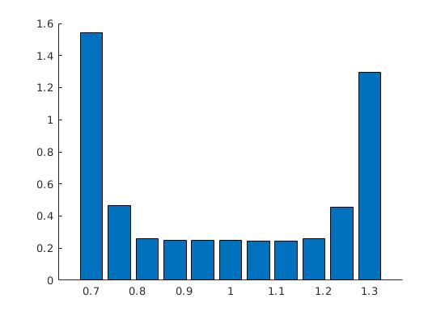

# Problem 3
Optimality of the Kalman filter

## System description
```
[dxdt] = y
[dydt] = -x
```
with initial condition [1,1], `dt` = 0.1, and normally distributed process and measurement noise with variance of 0.1.

I decided to make the observation matrix `C` the identity matrix, implying I can observe the entire state. This choice affects the shape of my Kalman gain `K`.

I distorted `K` (a 2x2 matrix, in my case) by a `d`, a scalar in the range `[0.7, 1.3]` (centered at 1, corresponding to "no distortion"). `K` is a diagonal matrix, so to distort it, I multiplied the first element by `d` and the second element by `2-d` (since `d` is centered at 1).

## Plots
Performance is measured by averaging the Euclidean norm of the estimation error over each simulation and then averaging that value over 100 simulations. The plot below shows that the Kalman filter (corresponding to the bar over 1) performs better than other "neighboring" estimators. 


